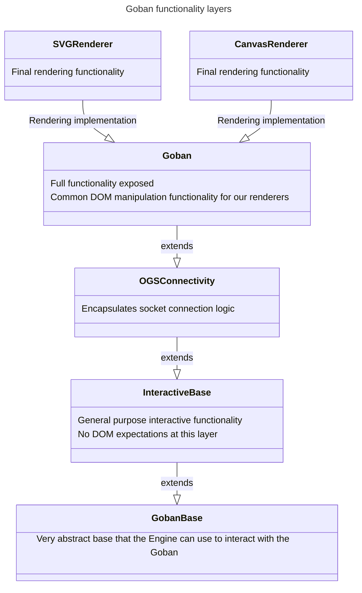

This directory contains primarily front end `Goban` functionality. 

The main class here is the `Goban` class, however because there is a lot of
code and functionality that get's bundled up into a `Goban`, we've broken up
that functionality across several files which implement different units of
functionality and we use class inheritance to stack them up to something
usable.

